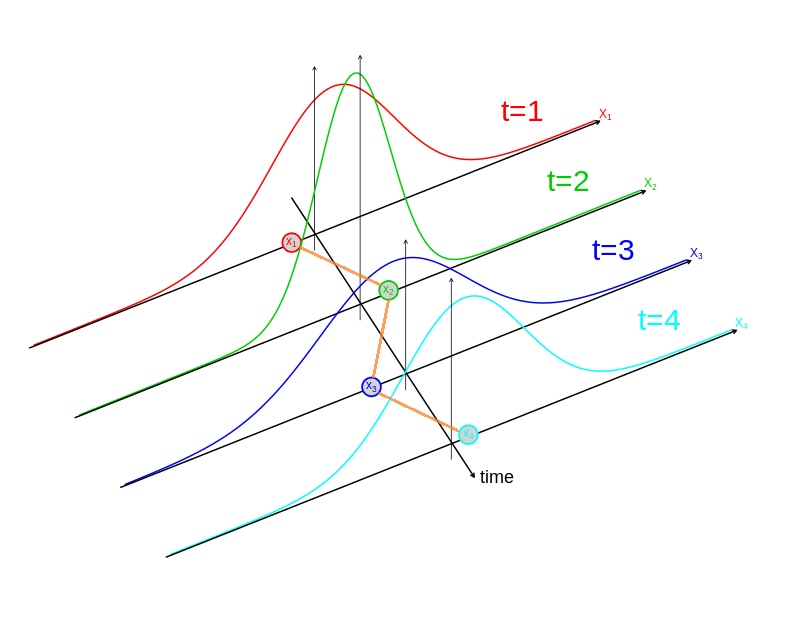

class: section, animated, flipInX

### a few very important

#Technical Details

---
class: hands, animated, fadeIn

#Language of instruction

The language of instruction for this course is **ENLISH**
##Anyone in the classroom who can **NOT** study in Russian? </br></br>

--

##Two of the practice session groups will work in Russian
.rmk[All of the course materials are in English anyhow.]

---
class: animated, fadeIn

#Other Tehcnical Details

Don't wait till the very end, ask quetions any time! </br></br></br>

--

The presentations alone are not substitutes to the lecture notes.</br></br></br>

--

.rotateInUpLeft.animated[.bb[?] .rb[!] .gb[*e.g.*] - You really wanna keep track of these guys!]

---
class: section, animated, fadeIn

### a very brief

#Intro to the Course

---
class: center, animated, fadeIn

#Time Series Econometrics

.bb[?] What is this course about?

--

.pull-left[**Econometrics**:

.rmk[what's your first thought?]]

--

.pull-right[**Time Series**:

.rmk[the first thing that pops out?]]

--

</br></br></br>
.bb[?] Why would we want to study **Time Series**?

.rmk[let's meet **Wooclap**]

---
class: animated, fadeIn

#Time Series **vs** Random Sample

.center[.bb[?] What is a *.RUred[random]* aka *.RUred[i.i.d.]* sample?]

--

.center[*.RUred[i]ndependently & .RUred[i]dentically .RUred[d]istributed*]

--

.center_img[
```{r echo = FALSE}

```
]

--

.center_img[
```{r echo = FALSE}

```
]

--

.center_img[
```{r echo = FALSE}

```
]

--

.center_img[
```{r echo = FALSE}

```
]

---
class: animated, fadeIn

#Time Series **vs** Random Sample

.center[.bb[?] What is a *.RUred[time series]*?]

.center_img[
```{r echo = FALSE}

```
]

--

.center_img[
```{r echo = FALSE}

```
]

--

.center_img[
```{r echo = FALSE}
knitr::include_graphics("stuff/ts03.png")
```
]

--

.center_img[
```{r echo = FALSE}

```
]

--

.center_img[
```{r echo = FALSE}

```
]

--

.center_img[
```{r echo = FALSE}

```
]

--

.center_img[
```{r echo = FALSE}

```
]

---
class: animated, fadeIn

#Time Series **vs** Random Sample

.pull-left[**Rnadom sample**: $\{x_i\}_{i=1}^n$


- from different objects
- unordered
- *i.i.d.*]

--

.pull-right[**Time Series**: $\{x_t\}_{t=1}^T$


- from the same object
- ordered in time
- doesn't have to be *i.i.d.*]

---
class: animated, fadeIn

#TSE: Gains & Challenges

.center[.bb[?] Why are these properties of TS are important?]

--

.pull-left[.pro[Gains]

collect more data

make predictions

construct richer models]

--

.pull-right[.con[Challenges]

.RUred[whole other math & stat tools are required] .rb[!]

computational capacity is really binding]

---
class: section, animated, fadeIn

### more on the course organization

#Structure & Grading

---
class: animated, fadeIn

#Classes

##Lectures

- delivering new material

- stressing the important points of the course

- checking the understanding

--

- **graded quizzes** based on lectures material

---
class: animated, fadeIn

#Classes

##Practice Sessions

- discussing the quizzzes

- solving problems

- empirical exercises

- Q&As


---
class: animated, fadeIn

#Graded Assignments

##Graded Quizzes

.pull-left[- in the beginning of **every lecture (starting the next week)**

- key points & examples **from the previous lectures or PSs**

- using **Wooclap**]

--

.pull-right[ - you must be **present in the lecture Zoom meeting**

- **use your real name**

- **an individual devise connected to the internet is required**]

---
class: animated, fadeIn

#Graded Assignments

##Homework Assignment

- the assignment will be distributed by the third lecture

- the deadline is 3 days before the exam, exact date TBA

--

- interim deadlines for some parts of the task (dates TBA in the assignment)

--

- this is a **group empirical project assignment**

---
class: animated, fadeIn

#Graded Assignments

##Homework Assignment

###Group composition

- team leader **+** 5-9 members

--

- teams must be assembled by 31/01

--

- the team leader is to email me the list of team members to **vpyrlik@cerge-ei.cz** 

--

- all the communication regarding the HWA via email is through the team leaders

---
class: animated, fadeIn

#Graded Assignments

##Exam

- is held during the official exam week (**exact date TBA**)

--

- covers **all the course** material

--

- 100% individual

- online

- in Wooclap

---
class: animated, fadeIn

#Grading
</br></br>
$$G_{RESULTING} = \lceil 0.4\times G_{EX} + 0.4\times G_{HW} + 0.2\times G_{Q} \rceil$$
</br>
--

$$G_{Q}=\lceil 0.2\times \Sigma_\color{blue}{q=2}^6 G_q\rceil$$
---
class: center, animated, zoomIn

#Selected course materials on *Padlet*

.url[https://padlet.com/vpyrlik/tse21]


#Thank you!

### See you next time
