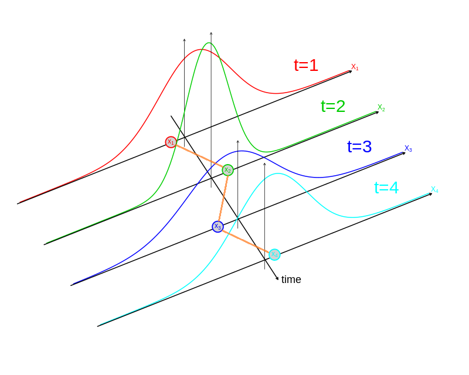
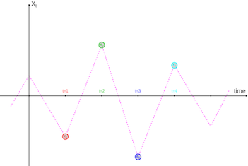
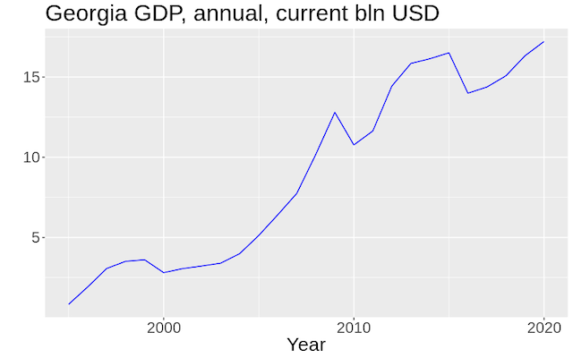
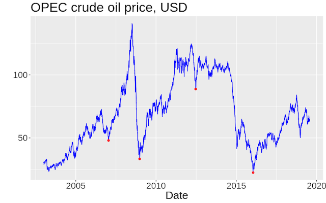
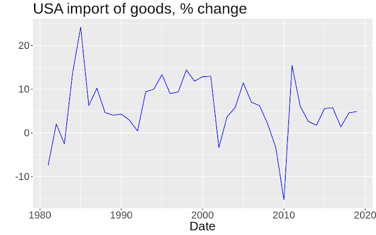
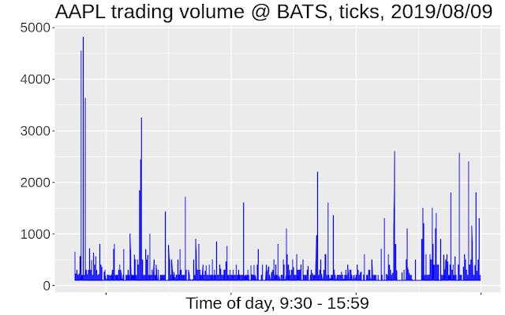

class: section, animated, fadeIn

#Quick Recall

### of the previous lecture

---
class: animated, fadeIn

#Quick Recall

- TSE = Econometrics + Time Series

- Our main focus: set of tools to deal with TS  

--

.bb[?] Can we use traditional econometrics with TS right away? 

--

.rb[!] No, TS are a lot different from *i.i.d* samples  

--

.gb[*e.g.*] Many theoretical results from *"traditional"* probability, statistics & econometrics require *i.i.d.* samples

---
class: center, tps, animated, fadeIn

##Think - Pair - Share   

--

.bb[?] 

### Name at least one *result, theorem, method, property* etc.
### from either *probability, statistics or econometrics*
### that relies on *i.i.d.*

---
class: animated, fadeIn

#Meet S&ETS for the first time

.rb[!] A lot of *crucial* econometric results require *i.i.d.*  

--

.bb[?] Does it mean we cannot apply them to TS?   

--

Luckily, no. Not all of them, but many have *".RUred[S&E TS versions]"*. 

--

.center[*.RUred[S]tationary & .RUred[E]rgodic .RUred[T]ime .RUred[S]eries*]

---
class: section, animated, fadeIn

###today:
#Stationarity   

###and we'll deal with *ergodicity* later

---
class: center, animated, fadeIn

#Strict Stationarity

--

### A time series process is *strictly stationary* if its joint probability distribution does not change when shifted in time.

--

--

.bb[?] Can we observe strict stationatity in the data?

---
class: center, animated, fadeIn

# Weak Stationarity

### .RUred[Weak] stationarity .rmk[aka] .RUred[Covariance] stationarity .rmk[aka] .RUred[2nd order] stationarity

--

### A time series process is *weakly stationary* if its *mean, variance and autocovariance* do not change when shifted in time.

--

.bb[?] Can we observe weak stationatity in the data?

---
class: center, animated, fadeIn

#Strict **vs** Weak Stationarity  

.bb[?] Can we say that if a TS process is *strictly stationary*  then it is *weakly stationary* as well?   

--

.bb[?] The opposite. Does weak stationarity imply the strict one? 

--

.bb[?] Construct a simple *counterexample* yourself  .rmk[(we'll discuss it in a practice session)]

---
class: animated, fadeIn

#Wrap-up

.center[Stationarty is *somewhat* **stability over time** of the TS distribution]

--

.pull-left[**Strict Stationarity**

- about the whole joint distribution

- implies weak stationarity

- can't be observed from the data]

--

.pull-right[**Weak Stationarity**

- only about the 1st & 2nd moments

- doesn't imply strict stationarity

- **can be tested from the data**]

--

.center[.bb[?] How can we test weak stationarity from the data?]

---
class: section, animated, fadeIn

###we're starting to work with data from

#Testing for Weak Stationarity

---
class: center, animated, fadeIn

##.gb[Example 1]

.bb[?] stationary or not?

---
class: center, animated, fadeIn

##.gb[Example 2]

.bb[?] stationary or not?

---
class: center, animated, fadeIn

##.gb[Example 3]

.bb[?] stationary or not?

---
class: center, animated, fadeIn

##.gb[Example 4]

.bb[?] stationary or not?

---
class: animated, fadeIn

#Approaches to Testing for Stationarity

.center[.bb[?] What types of testing have we already used? ]

--

###1. Essential (economic) judgement 

--

###2. Visual analysis 

--

###3. Formal testing .rmk[not covered yet]

--

.center[.rb[!] There's no one simple algorithm to test for stationarity]

--

.center[However, it's easier to reject stationarity than to accept it.]

---
class: animated, fadeIn

#Typical types of **non-stationarity**
###what are we looking for in eather essential or visual analysis?

--

1. **Trends**: .gb[*e.g.*] growth, seasonality, etc.

--

2. **Structural Shifts**: .gb[*e.g.*] shocks, policy interventions, etc.

--

3. **Heteroskedasticity**: .gb[*e.g.*] agents' reaction to new info   

--

.center[.bb[?] Think of real life examples of *economic* non-stationary TS .rmk[we'll discuss it in a practice session]]

---
class: animated, fadeIn

#Wrap-up

- It is easier to  .bb[?]  stationarity than to  .bb[?]  it   

--

- Three main approaches to stationarity testing are: .bb[?], .bb[?], .bb[?]   

--

- Main types of non-stationarity of economic TS are: .bb[?], .bb[?], .bb[?]   

--

- Some examples of non-stationary economic TS are: .bb[?], .bb[?], .bb[?]   

--

- Economic jungement is  .bb[?]  and  .bb[?]  formal testing

---
class: center, middle, animated, zoomIn

#Thank you!

### See you next time
