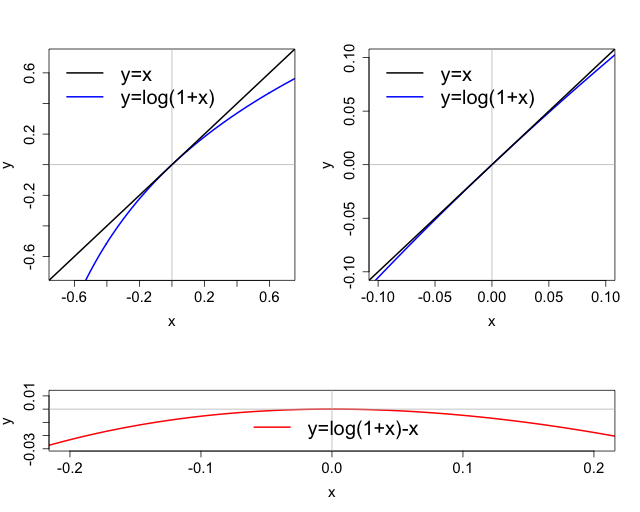

class: hands, middle, animated, fadeIn

#Stretching

---
class: hands, animated, flipInX     

.gb[Example 1] **The Big Mac Index**: *USD/RUR* PPP exchange rate


.bb[?] **Stationary?** *Defenitely not / Not likely / Might be?*

---
class: hands, animated, flipInY

.gb[Example 2] **Gini Index**: Russian annual income inequality


.bb[?] **Stationary?** *Defenitely not / Not likely / Might be?*

---
class: hands, animated, flipInX

.gb[Example 3] **Population**: Russian age 10 males, annual change


.bb[?] **Stationary?** *Defenitely not / Not likely / Might be?*

---
class: section, animated, fadeIn

#Quick Recall

### of the previous lecture

---
class: animated, fadeIn

#Quick Recall

- TS are a lot different from RS

--

- Many traditional tools are not applicable to TS right away, ...

--

- but there are applicable versions for S&ETS

--

- Stationarity is a crucial concept in TS

--

- Types of stationarity: strict & weak

--

- Strict is only theoretical, and weak can be observed in the data

--

- Essential judgment & visual analysis are important tools, ...

--

- .RUred[but often *formal testing* is required, too.]

---
class: section, animated, fadeIn

#Stationarity: Formal Testing

---
class: animated, fadeIn

#General Formal Testing: a brief recap

.gb[e.g.] Consider a simple **one-sample two-sided *z*-test**. Given some data $\{x_i\}_{i=1}^N$, with $x_i\sim\text{i.i.d.}$, test the null $H_o=\{\mathbb{E}x=\mu_o\}$ versus $H_a=\{\mathbb{E}x\neq\mu_o\}$.

--

.bb[?] What are **hypotheses**?

--

.bb[?] What is a **statistical test**? .rmk[aka a *conventional statistical criterion*]

--

.bb[?] What is a **test statistics**? .rmk[why is this test called "*z*"?]

--

.bb[?] What is a **critical value**?

--

.bb[?] What is a **P-value**?

--

.bb[?] What is the general **scheme of a test application**?

---
class: animated, fadeIn

#Formal Testing for a TS Stationarity

There are several approaches. Two are most commonly used.

--

### 1. Augmented Dickey - Fuller (ADF) Test

- $H_o = \{\text{unit root}\}$ **vs** $H_a=\{\text{TS is stationary}\}$.
.right[.rmk["*unit root*" is a type of non-stationarty (we'll deal with it next time)]]

--

- under true null the **test statistics has a non-standard distribution**, critical values and P-values can only be tabulated

--

.rb[!] ADF tends to **under-reject the FALSE null**</br>when a truly stationary TS is close to being non-stationary

---
class: animated, fadeIn

#Formal Testing for a TS Stationarity

There are several approaches. Two are most commonly used.

### 2. Kwiatkowski - Phillips - Schmidt - Shin (KPSS) Test

- $H_o=\{\text{TS is stationary}\}$ **vs** $H_a=\{\text{TS is non-stationary}\}$.
.right[.rmk[.rb[!] compare the hypotheses with the ones of ADF above]]

--

- critical values and P-values can only be tabulated</br>

--

.rb[!] often used to support or double-check the results of ADF test

---
class: center, animated, fadeIn

##Recall [.gb[Example 3] from the previous lecture](https://vpyrlik.github.io/tse19lec01/slides.html#31)

.pull-left[

</br></br>

```{r table1, echo=FALSE, message=FALSE, warnings=FALSE, results='asis'}
tabl <- " 
| Test          | P-value        |
|:--------------|:--------------:|
| ADF           | 0.068          |
| KPSS          | > 0.1          |
"
cat(tabl)
```

]

--

.pull-right[</br>

.bb[?] What are the first steps to test stationarity?</br></br></br></br></br></br>

.bb[?] How do we interpret the tests results?

]

---
class: center, animated,  flipInY

##Recall [.gb[Example 2] from the previous lecture](https://vpyrlik.github.io/tse19lec01/slides.html#30)

.pull-left[

</br></br>

```{r table2, echo=FALSE, message=FALSE, warnings=FALSE, results='asis'}
tabl <- " 
| Test          | P-value        |
|:--------------|:---------------|
| ADF           | < 0.01         |
| KPSS          | > 0.1          |
"
cat(tabl)
```

]

.pull-right[</br>

.bb[?] What are the first steps to test stationarity?</br></br></br></br></br></br>

.bb[?] How do we interpret the tests results?

]

---
class: center, animated,  flipInX

##Recall .gb[Example 2] from earlier today

.pull-left[

</br></br>

```{r table3, echo=FALSE, message=FALSE, warnings=FALSE, results='asis'}
tabl <- " 
| Test          | P-value        |
|:--------------|:---------------|
| ADF           | 0.90         |
| KPSS          | > 0.1          |
"
cat(tabl)
```

]

.pull-right[</br>

.bb[?] What are the first steps to test stationarity?</br></br></br></br></br></br>

.bb[?] How do we interpret the tests results?

]

---
class: animated, fadeIn

#Wrap-up

- There are many formal tests of stationarity

- The two most commonly used test are: .bb[?] & .bb[?] </br></br>

--

- The main difference between the two is .bb[?] </br></br>

--

- ADF test has the tendency to .bb[?] </br></br>

--

- KPSS test is often used to .bb[?]

---
class: animated, fadeIn

#What's next?

Thus, many important economic series are non-stationary. 

.bb[?] So what? </br></br>

--

.rb[!] Modeling *often* requires stationarity. </br></br>

--

### Next in the course

- Stationary transformations .rmk[(now)]

--

- Linear modeling & prediction .rmk[(weeks 3-4)]

---
class: section, animated, fadeIn

#Stationary Transformations

###a way to deal with non-sattionary TS

---
class: center, animated, fadeIn

#.left[Stationary Transformations]

.rb[!] A lot of crucial economic TS are **essentially non-stationary**</br>

--

.bb[?] Have we seen earlier today .rmk[(or even earlier)]</br> an example of a **stationary transformation**?

--

Recall .gb[Example 3] from the previous lecture again

.pull-left[


]

--

.pull-right[

.left[</br>.bb[?] What is the transformation here?]

.left[.bb[?] How does the initial import series look?]

]

---
class: animated, fadeIn

#Stationary Transformations

Non-stationary TS are transformed into stationary ones for modeling. </br>

--

.rb[!] Type of transformation depends on type of non-stationarity. </br>

--

- Most transformations are to handle *trends in mean prior to modeling*. </br> 

--

- *Structural breaks* & *heteroskedasticity* are dealt with *inside the models*.

---
class: animated, fadeIn

#De-trending Transformations

There are many types of transformations. </br></br>

Usually, same TS can be transformed into a stationary one</br>via several different transformations.</br></br>

--

.rb[!] **Essential meaning** of a transformation is crucial.

---
class: animated, fadeIn

#De-trending Transformations

.gb[*e.g.*] Compare **percentage changes** & **deviations from a trend**</br></br>

--

.rb[!] percentage change is one-period change in the value

- good for **short-run** policy effects evaluation or prediction </br></br>

--

.rb[!] trends show **long-run** tendencies

- *might be used* in LR prediction or causality analysis,</br>.rmk[but actually, these are almost never done in practice anymore.</br>Why not? Revisit this in a practice session]

---
class: animated, fadeIn

#De-trending Transformations
###Main types of stationary transformations

- **difference transformations** & log-differences </br></br>

- growth rates & percentage change </br></br></br>

--

.rb[!] They are all based on **difference transformations**.

---
class: animated, fadeIn

#Difference Transformations

.gb[Example 1] Carbon Dioxide Emmissions - Morocco (annual, Mt)


---
class: center, animated, fadeIn

#.left[Difference Transformations]</br>

Givent a TS process $\{X_t\}_{t=-\infty}^{+\infty}$, the **first difference** of the TS is

$$\Delta X_t\equiv X_t-X_{t-1}$$ </br></br>

--

The **difference of order *p*** .rmk[(*aka* the *p*-th difference)] is

$$\Delta^p X_t\equiv\Delta\left(\Delta^{p-1}X_t\right),\;p>1$$

---
class: animated, fadeIn

#Difference Transformations: interpretation

.gb[Example 2] Some simulated data

.center_img[]

---
class: tps, animated, flipInX

##Think - Share </br></br>

.bb[?]

###Say, the 1st diffs are positive on average (mean > 0).

###Does it .RUred[guarantee] that the levels grew over the period?

---
class: animated, fadeIn

#Difference Transformations: interpretation

.gb[Example 2] Some simulated data

.center_img[]

--

.center_img[]

--

.center_img[]

--

.center_img[]

--

.center_img[]

--

.center_img[]

--

.center_img[]

--

.center_img[]

--

.center_img[]

--

.center_img[]

--

.center_img[]

--

.center_img[]

--

.center_img[]

--

.center_img[]

---
class: animated, fadeIn

#Difference Transformations

- diffs preserve the same units

- the 1st diffs are easily interpritable</br></br>

--

.rb[!] often the 1st diffs are not enough to "kill" the non-stationarity

.rb[!] higher orders of diffs are harder to interpret</br></br>

--

- 2nd order diffs are sometimes used

- 3+ orders are almost never used in practice

---
class: center, animated, fadeIn

#.left[Other Transformations]

###The percentage change .rmk[aka] growth rate

The **1-period percentage cahnge** .rmk[aka] **1-period growth rate** is

$$\rho_t=\frac{\Delta X_t}{X_{t-1}}=\frac{X_t}{X_{t-1}}-1$$

--

.left[

.rb[!] shows 1-period **scale-free change**

.rb[!] often **kills NS better** than the diffs

]

--

.left[

.rb[!] unlike the diffs, **not additive**

]

---
class: center, animated, fadeIn

#.left[Other Transformations]

###Log-differences .rmk[aka] log-returns .rmk[aka] log growth rate

--

Givent a TS process $\{X_t\}_{t=-\infty}^{+\infty}$, the **log-difference** of the TS is

$$\Delta \log X_t\equiv \log X_t-\log X_{t-1}=\log\left(\frac{X_t}{X_{t-1}}\right)$$

--

.bb[?] Why "*log growth rate*"?

--

$$\log\left(\frac{X_t}{X_{t-1}}\right)=\log\left(\frac{X_t-X_{t-1}}{X_{t-1}}+1\right)\approx\frac{X_t-X_{t-1}}{X_{t-1}}$$
--

.rb[!] When $\rho_t$ is "*small enough*",</br>growth rate and log-diffs are "*almost the same*"

---
class: center, animated, flipInX

##Log-diffs **vs** growth rate *numerically*


---
class: animated, fadeIn

#Log-diffs: interpretation

.gb[Example 3] Some simulated log-diffs

.center_img[]

---
class: hands, animated, flipInX

</br></br></br>.bb[?]</br>Say, The log-diffs are positive on average (mean > 0)</br>Does it .RUred[guarantee] that the levels grew over the period?</br></br></br></br>


.bb[?]</br>How do we interpret the mean of log-diffs over some period?

---
class: animated, fadeIn

#Difference Transformations: interpretation

.gb[Example 3] Some simulated log-diffs

.center_img[]

--

.center_img[]

--

.center_img[]

--

.center_img[]

--

.center_img[]

--

.center_img[]

--

.center_img[]

--

.center_img[]

--

.center_img[]

--

.center_img[]

--

.center_img[]

--

.center_img[]

---
class: animated, fadeIn

#% Change & Log-differences: interpretation

- both often kill NS better when 1st diffs are not enough</br></br>

--

- both show 1-period change</br></br>

--

- very close technically & essentially</br></br>

--

- unlike % change, log-diffs are additive</br></br>

--

.rb[!] often .rmk[(not always!)] log-diffs are preferred to % change to kill NS

---
class: center, animated, rubberBand

###for this class we have a self-directed
#Take-home Wrap-up</br>

###go to **wooclap.com/TSWRAPUP** and complete the quizz
.rmk[it's gonna help you a lot the next week!]</br></br></br></br>

#Thank you!
### See you next time
