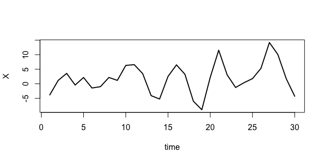

class: section, animated, fadeIn

###A truly very 

#Quick Recall

###of what we've done so far

---
class: animated, fadeIn

###A truly very
#Quick Recall

- We've been working on stationarity a lot

--

- Why? We heard we need it for modeling  

--

.center[

###Now we're starting

# Stationary Time Series Linear Univariate Modeling

]

---
class: tps, animated, fadeIn
#DGPs  vs  Models 

We're going to be talking a lot of **Data Generating Processes** and even more of **Models**   

.bb[?]

###What is the difference between a **DGP** & a **model**?

---
class: center, animated, fadeIn

#DGPs vs Models  

###When we say **"This is the the TS's DGP"**, we literally mean this is **ALL** .cross[we can tell] **that can be known** about this TS

--

.right[.rmk[DGPs can only be analyzed "theoretically"]]  

--

###A **model is a simplified description** of a .rmk[possibly unknown] DGP.

--

.right[.rmk[Models can be fit to the data and used to "test stuff"]]

---
class: section, animated, fadeIn

###Some important pieces of

#Linear Univariate TS DGPs

---
class: animated, fadeIn

#Brief Outline

.bb[?] Why do we need the DGPs?

.rb[!] We are gonna use them as *construction blocks* for models  

--

We're gonna see **several DGPs** and for each of them

- tell **why** we need it

- outline the important **properties** .rmk[(stationarity, moments...)]

- point out important **special cases**

- **compare** with the other ones

---
class: animated, fadeIn

#White Noises

##Strict white noise

--

.center[

###Time Series $\{\varepsilon_t\}_{t=-\infty}^\infty$ is called **strict white noise (SWN)** if

]

$$\varepsilon_t\sim\text{i.i.d.},\;\text{with}\;\mathbb{E}\varepsilon_t=0,\;\text{and}\;\mathbb{E}\varepsilon_t^2=\sigma^2<\infty.$$

 

--

###"Even Stricter" white noise

.gb[*e.g.*] Consider $\varepsilon_t\sim\text{i.i.d.}\mathcal{N}(0,\sigma)$ *aka* **Normal SWN**

---
class: animated, fadeIn

#White Noises

##Weak white noise

.center[

###Time Series $\{\varepsilon_t\}_{t=-\infty}^\infty$ is called **weak white noise**, $WWN(\sigma)$ if

]

$$\forall t \;\; \mathbb{E}\varepsilon_t=0,\;\mathbb{E}\varepsilon_t^2=\sigma^2<\infty,\;\text{and}\;\forall j\neq0\;\mathbb{E}(\varepsilon_t\varepsilon_{t-j})=0.$$

--

.bb[?] Does it remind you of something we saw before?

--

.bb[?] Can a TS be *SWN* and NOT a *WWN*?

--

.bb[?] What about the opposite? .rmk[Think of or look up a counterexample.]

---
class: animated, fadeIn

#White Noises: summary

.bb[?] **Why** do we need WN series?

.rb[!] As **analogs of random error terms** in TS models

 

--

.rb[!] We prefer using WWNs rather than SWNs.

--

.bb[?] Why? .rb[!] Because it can be verified from data.

 

--

.rb[!] often SWN needs to be used anyway

---
class: animated, fadeIn

#Moving Averages

--

.center[

###Time Series $\{X_t\}_{t=-\infty}^\infty$ is called **moving average of order *q***, $\:MA(q),q<\infty$ if

]

$$X_t=\mu + \varepsilon_t + \theta_1\varepsilon_{t-1}+...+\theta_{q}\varepsilon_{t-q},\;\text{and}\;\varepsilon_t\sim WWN(\sigma).$$

--

.bb[?] When is it stationary? .rmk[what kind of stationary?]

--

.bb[?] Find the first two moments of $X_t$, including $\text{cov}(X_t,X_{t-j})$.

--

###Somewhat a "special case": $\:MA(\infty)$

.rb[!] Stationary, when $\sum_{j=1}^\infty|\theta_j|<\infty$.

---
class: animated, fadeIn

#Autoregressive Processes

## AR(1) 

.center[

###Time Series $\{X_t\}_{t=-\infty}^\infty$ is called **autoregressive of order *1***, $\:AR(1)$ if

]

$$X_t=\mu + \varepsilon_t + \phi_1X_{t-1},\;\text{and}\;\varepsilon_t\sim WWN(\sigma).$$

--

.bb[?] When is it stationary? 

--

.bb[?] Find the first two moments of $X_t$, including $\text{cov}(X_t,X_{t-j})$.

---
class: animated, fadeIn

#Autoregressive Processes

##A special case: random walk

.center[

###Time Series $\{X_t\}_{t=-\infty}^\infty$ is called **a random walk** if

]

$$X_t=X_{t-1} + \varepsilon_t,\;\text{and}\;\varepsilon_t\sim WWN(\sigma).$$

--

.cross[.bb[?] When is it stationary? ]

.cross[

.bb[?] Find the first two moments ...

]

--

.rb[!] This is the simplest example of a **unit root** process

--

.rb[!] Now we can distinguish a **trend** from a **unit root**

---
class: animated, fadeIn

#Autoregressive Processes

## The general AR(p) 

.center[

###Time Series $\{X_t\}_{t=-\infty}^\infty$ is called **autoregressive of order *p***, $\:AR(p),p<\infty$ if

]

$$X_t=\mu + \varepsilon_t + \phi_1X_{t-1}+...+\phi_pX_{t-p},\;\text{and}\;\varepsilon_t\sim WWN(\sigma).$$

--

.bb[?] .cross[When is it stationary?] .rmk[deal with this in the next slide]

.bb[?] Given $X_t$ is stationary, find its first two moments.

---
class: animated, fadeIn

#Autoregressive Processes

## AR(p) stationarity conditions

--

### The characteristic polynomial 

.center[

###Given $X_t$ an AR(p) process, its **characteristic polynomial** is

]

$$\phi(z)=1-\phi_1z-\phi_2z^2-...-\phi_pz^p.$$

--

### Stationarity condition

.center[

###The process $X_t$ is then stationary if the **roots** of $\phi(z)$ lie **outside the unit circle**.

]

---
class: animated, fadeIn

##.gb[Example 1]

Consider an AR(2) process 
$$X_t=1.25 + 0.85X_{t-1}-0.48X_{t-2}+\varepsilon_t.$$

--

.bb[?] Is anything missing?

--

.bb[?] Write down $\phi(z)$, find its roots, and check if $X_t$ is stationary.

   

--

.right[

.rmk[

check at home that the roots are indeed $z_{1,2}=0.89\pm1.14i$, $|z_{1,2}|\approx1.44$

]

]

---
class: animated, fadeIn

##.gb[Example 2] *Why "unit root"?*

Consider an AR(3) process 
$$X_t=1.25 + 0.85X_{t-1}-0.48X_{t-2}-0.32X_{t-3}+\varepsilon_t,\;\varepsilon_t\sim WWN(\sigma)$$

--

The roots of $\phi(z)$ are .rmk[(check at home)]

- $z_{1,2}=0.66\pm0.81i$, $|z_{1,2}|\approx1.05$

- $z_3=-2.83$. 

--

.bb[?] Is $X_t$ stationary?

--

.bb[?] Is it that horrible that $z_{1,2}$ is **close to unit circle**? .rb[!] Yes!

---
class: animated, fadeIn

.center[

##Compare two simulations  

]

.pull-left[

.center[.gb[Simulation 1]]

.center[**ADF P-value** is **0.06**]

]

.pull-right[

.center[.gb[Simulation 2]]

.center[**ADF P-value** is **0.14**]

]

---
class: animated, fadeIn

#ARMAs

.center[

###Time Series $\{X_t\}_{t=-\infty}^\infty$ is called **an autoregressive moving average of orders *p* and *q*, ARMA(p,q)** if

]

$$X_t=\mu + \varepsilon_t + \sum_{i=1}^p\phi_iX_{t-i}+\sum_{j=1}^q\theta_{j}\varepsilon_{t-q},\;\text{and}\;\varepsilon_t\sim WWN(\sigma).$$

--

.rb[!] The characteristic polynomial comes from the AR part.

.rb[!] The stationarity is defined by AR part, too.

--

.bb[?] Find .rmk[(or look up)] the moments of a stationary ARMA.

--

.rb[!] ARMA is an important DGP & **the most important ULM**

---
class: section, animated, rubberBand

#Why do we need the ARMAs?

---
class: animated, fadeIn

#Why do we need the ARMAs?

##1. Wold's decomposition .rmk[aka] **linear representation theorem**

.center[

###Given $\{X_t\}_{t=-\infty}^\infty$ a **weakly stationary process**, it can be represented as

]

$$X_t=d_t + \epsilon_t + \sum_{j=1}^{\color{red}\infty}\psi_j\epsilon_{t-j},\;\text{where}$$

- $d_t$ is a *"deterministic" component*

- $\epsilon_t\sim WWN(\sigma_\epsilon)$, .rmk[tsc] *"Wold's innovations"*

- $\sum_{j=1}^\infty|\psi_j|^2<\infty$, and $\psi$s is *"causal"* & *"recent"*

---
class: animated, fadeIn

#Why do we need the ARMAs?

##2. Box & Jenkins **modeling** approach

--

.center[

.rb[!] It is not an "exact algorithm" & there're many versions

]

 

--

.center[

###The **general idea** is that

###A sample TS that comes from a stationary process can be **modelled as ARMA(p,q)** so that **the order isn't "too high"** & **the residuals "resemble" WWN**.

]

---
class: animated, fadeIn

#Why do we need the ARMAs?

##2. Box & Jenkins modeling approach: **a rough algorithm**

0. Get data that are **tested as stationary** .rmk[.gb[*e.g.*] some transformed data]

--

1. Choose appropriate **maximum** orders *p* & *q*
.right[.rmk[there's no one good way; normally *p* & *q* are up to 5-6]]

--

2. **Fit** ARMAs up to that order to the data .rmk[.gb[*e.g.*] use a version of *MLE*]

--

3. Test them for **residual autocorrelation** & drop those that fail
.right[.rmk[many tests can be used]]

--

4. Pick **the one** that fits the data **best**
.right[.rmk[again, no unique criterion to show that]]

---
class: animated, fadeIn

#Why do we need the ARMAs?

##2. Box & Jenkins modeling approach: **a take-home task**

### As an example and a tutorial of the Box-Jenkins modeling approach application, see the classes from **edX Macroeconomic Forecasting MOOC**

--

.rb[NB] .RUred[You don't need to sign up for the paid certificate!]

--

###Enroll at .url[https://www.edx.org/course/macroeconometric-forecasting-2]

--

###Study **Module 3** (at least), pay attention to the **essential information** rather than *soft application*

---
class: center, animated, fadeIn

#Take-home Wrap-up

##Part I: Important Linear DGPs: summary

---
class: center, animated, fadeIn

#Take-home Wrap-up

##Part II: Box & Jenkins modeling approach: details 

###Based on **Module 3 of the MOOC** suggest

.left[

- an approach towards ARMA order choice

- testing tools for ARMA residuals

- criteria to pick one model

]

 

--

**.RUred[The results are required: Part I by tomorrow, Part II by 27/02]**

---
class: center, middle, animated, rubberBand

#Thank you!

### See you next time
