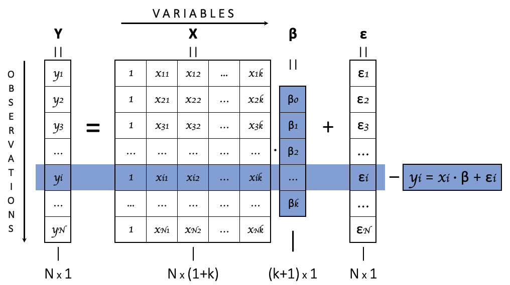

class: hands, animated, fadeIn

  

##Who's excited that we're done with **univariateness**?

   

--

###And we don't have a recall of the previous classes today.

--

##Instead we'll recall some stuff from **Econometrics I**

---
class: tps, animated, zoomIn

#Multivariate Linear Regression

##Take a minute to think & discuss with 1-2 people around you

#Why do we need .RUred[Multivariateness]?

###whether in the context of TS or not

---
class: section, animated, fadeIn

###A recap from Econometrics I

 

#Multivariate Linear Regression 
##for .RUred[random samples]

---
class: animated, fadeIn

#MLR for RS: notation

.center[

###The main expression for a MLR **in by-observation form** is

]

$$y_i = \beta_o + \beta_1 x_{1i} + ... \beta_k x_{ki} + \varepsilon_i.$$

--

- $i$ is the **observations index**,

--

- $y_i$ is the **dependent variable** .rmk[*aka* left-hand side variable]

--

- $x_i$s are $k$ **explanatory variables**, $\{x_{ij}\}_{j=1}^k$ .rmk[*aka* RHS variables *or* regressors *or* covariates *or* controls]

--

- $\beta$s are $k+1$ **regression coefficients** .rmk[*aka* parameters]

--

- $\varepsilon_i$ is the .cross[*residual*] **error term**  

---
class: animated, fadeIn

#MLR for RS: notation

.center[

###The main expression for a MLR **in by-observation form** is

]

$$y_i = \beta_o + \beta_1 x_{1i} + ... \beta_k x_{ki} + \varepsilon_i = \color{blue}{x_i\beta+\varepsilon_i},$$
.center[

###or **given data sample** $i=1,...N$ **in matrix form**:

]

$$Y=X\beta+\varepsilon.$$

--

- $Y$ is the $N\times1$ vector of $y_i$s, & $\varepsilon$ is $N\times1$ vector of $\varepsilon_i$s.

--

- $X$ is $N\times(\color{red}{1+}k)$ matrix with **rows** $x_i=(\color{red}{x_{io}=1},x_{i1},...x_{ik})$

--

- $\beta$ is $(\color{red}{1+}k)\times1$ vector $\beta=(\color{red}{\beta_o},\beta_1,...,\beta_k)'$

---
class: center

###MLR Matrix Form

.animated.zoomIn[

]

---
class: animated, fadeIn

#MLR for RS: .RUred[assumptions]

###.center[The "model"]

$$y_i=x_i\beta+\varepsilon_i$$

###.center[is **NOT a model, unless** we have **.RUred[assumptions]**:]

--

 

.rb[rsA1] **Random sample**: $\{y_i,x_i,\varepsilon_i\}_{i=1}^{N}$ are *i.i.d.*

--

 

.rb[rsA2] **Exogenous error**: $\mathbb{E}[\varepsilon_i|x_i]=0$

---
class: center, animated, fadeIn

#.left[MLR for RS: OLS estimates]

###The actual coefficients $\beta$ are unknow,
###hence, we use data $\{y_i,x_i\}_{i=1}^N$ to estimate them.

--

 

##OLS estimation

$\hat\beta^{OLS}=\arg\min_{b}\sum_{i=1}^N(\underbrace{y_i-x_ib}_{\equiv e_i(b)})^2=(X'X)^{-1}X'Y$

.right[.rmk[**HW**: derive or look it up]]

---
class: animated, fadeIn

#MLR for RS: .RUred[OLSE properties (I)]

.center[

##How do the estimates $\hat\beta^{OLS}$ realte to the actual $\beta$s?

]

--

.bb[?] Derive the difference $\hat\beta^{OLS}-\beta$

.bb[?] How can we describe it?

--

.bb[?] Find the expectation of the difference.

--

.bb[?] What'd happen with the difference as $N\to\infty$?

--

.bb[?] "Slow down" that convergence & get a distribution in the limit.

--

.bb[?] How did we use the assumptions .rb[rsA1] & .rb[rsA2]?

---
class: animated, fadeIn

#MLR for RS: .RUred[OLSE properties (II)]

Thus, the difference between the actual $\beta$s & their OLSE is

$$\sqrt{N}(\hat\beta^{OLS}-\beta)=\bigg(N^{-1}\sum_{i=1}^Nx_i'x_i\bigg)^{-1}\cdot\bigg(N^{-\frac{1}{2}}\sum_{i=1}^Nx_i'\varepsilon_i\bigg)$$

--

As $N\to\infty$, by some theorems & assumptions, .right[.rmk[.bb[?] name them all and point out where they are used]] 

$$\sqrt{N}(\hat\beta^{OLS}-\beta) \rightarrow \mathcal{N}\big(\mathbb{O}_{k+1},V_\beta\big)$$

--

.bb[?] Why is this result important?

.bb[?] How do we know what's $V_\beta$? Find it for *i.i.d.* $\varepsilon$s.

---
class: hands, animated, fadeIn

 

#Can we apply these results to the TS case?
###Yes / Maybe / No

--

 

##In what case these results are valid for TS?

---
class: section, animated, fadeIn

#Some Probability Theorems
##for Stationary & Ergodic Time Series

---
class: center, animated, fadeIn

### Another important TS concept

#Ergodicity

###Time Series $X_t$ is **ergodic** if $\forall t$ the dependence between $X_t$ & $X_{t-j}$   "decays" for higher $j$ $\;$ & $\;$ "vanishes" as $j\to\infty$

--

 

.rb[!] Unlike stationarity, **ergodicity** can't be verifed from data. We can only assume it *essentially*.

--

 

.gb[*e.g.*] Discuss, are stationary transformed economic TS ergodic? Give examples.

---
class: center, animated, fadeIn

#Ergodic Theorem

For a weakly S&E TS $\{X_t\}_{t=-\infty}^{\infty}$, with $\mathbb{E}|X_t|<\infty$, as $T\to\infty$

$$T^{-1}\sum_{t=1}^T X_t \xrightarrow{p} \mathbb{E}X_t.$$

--

 

.left[

.bb[?] What is this theorem TS-analog for?

]

--

.left[

.bb[?] What's the probability limit of $T^{-1}\sum_{t=1}^Tx_t'x_t$?

]

---
class: center, animated, fadeIn

#CLT for General Dependent Observations

For a weakly S&E TS $\{X_t\}_{t=-\infty}^{\infty}$, with 

$$LRV_X=\sum_{j=-\infty}^{+\infty}\text{cov}(X_{t},X_{t-j})<\infty,$$
as $T\to\infty$

$$\sqrt{T}\bigg(T^{-1}\sum_{t=1}^TX_t-\mathbb{E}X_t\bigg)\xrightarrow{d}\mathcal{N}\big(\mathbb{O};LRV_X\big),$$
and $LRV_X$ is called the **long-run variance** of $X_t$.

---
class: animated, fadeIn

#Estimation of LRV

- There are many versions of a S&E TS LRV Estimates

- They differently handle the infinite summation of covariances

--

##Newey-West LRV Estimator

$$\widehat{LRV}_X^{NW}=\sum_{j=-m}^{m}\bigg(1-\frac{|j|}{m+1}\bigg)\cdot\hat\gamma_j,\;m=\big\lfloor4(T/100)^{1/3}\big\rfloor,$$

and $\hat\gamma_j$s are sample autocovariances of $X$.

--

.rb[!] It works for vector TS as well (LRV & $\gamma$s are matrices then).

---
class: section, animated, fadeIn

#Multivariate Linear Regression 
##for Stationary & Ergodic Time Series

---
class: animated, fadeIn

#MLR: extension for S&E TS

###.center[The notation and interpretation are almost the same]

$$y_t=\beta_o+\beta_1x_{1t}+...+\beta_kx_{tk}+\varepsilon_t,\;\text{or}\;Y=X\beta+\varepsilon.$$
--

##The .RUred[assumptions] are different

.rb[tsA1] **Stationary TS sampling**: $\{y_t,x_t,\varepsilon_t\}$ are weakly S&E TS.

.rb[tsA2] **Exogenous error**: $\mathbb{E}[\varepsilon_t|X_t]=0$.

--

.rb[!] We don't require the error term to be WWN.
.right[.rmk[.bb[?] why is this imoprtant?]]

---
class: animated, fadeIn

#MLR for S&E TS: OLSE & properties (I)

###OLS works exactly the same

$$\hat\beta^{OLS}=(X'X)^{-1}X'Y,\;\text{and}\;\hat\beta^{OLS}-\beta=(X'X)^{-1}X'\varepsilon.$$

--

###Propertires are almost the same, too

- By .rb[tsA1] & .rb[tsA2]: $\mathbb{E}(\hat\beta^{OLS}-\beta)=0.$

--

- By **ergodic theorem** & .rb[tsA1] & .rb[tsA2], as $T\to\infty$

$$\hat\beta^{OLS}-\beta\xrightarrow{p}0.$$

.right[.rmk[**HW**: check those, use the same tricks as before]]

---
class: animated, fadeIn

#MLR for S&E TS: OLSE & properties (II)

##Asymptotic distribution is substantially different

$$\sqrt{T}(\hat\beta^{OLS}-\beta)\xrightarrow{d}\mathcal{N}(\mathbb{O}_{k+1},V_\beta),$$

but $V_\beta$ contains *LRV* of $x_t'\varepsilon_t$. .rmk[*Newey-West estimation is required*]

--

##NW-HAC Estimator of $V_\beta$

$$\hat V_\beta=\bigg(T^{-1}\sum_{t=1}^Tx_t'x_t\bigg)^{-1}  \Bigg[\sum_{j=-m}^m\bigg(1-\frac{|j|}{m}\bigg)\hat\Gamma_j^{x'e}\Bigg]  \bigg(T^{-1}\sum_{t=1}^Tx_t'x_t\bigg)^{-1}$$

---
class: animated, fadeIn

#Wrap-up

- Multivariateness is as important in TS context as outside of it

--

- MLR for S&E TS works *almost* the same way as for RS

- OLSE are calculated the same and are unbiased and consistent

--

- We .cross[don't] **must not** require that $\varepsilon_t\sim WWN$

--

- Hence, we use CLT for dependent observations

- And apply LRV estimator for asymptotic variance of OLSE

--

- Newey-West Heteroskedasticity & Autocorrelation Correction is required for concisitent S.E.s in the regression
---
class: center, middle, animated, rubberBand

#Thank you!

### See you next time
