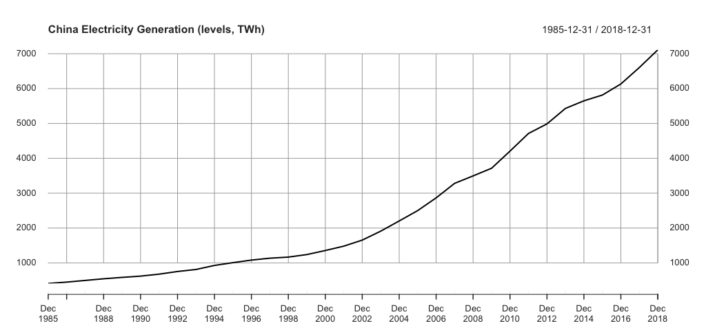
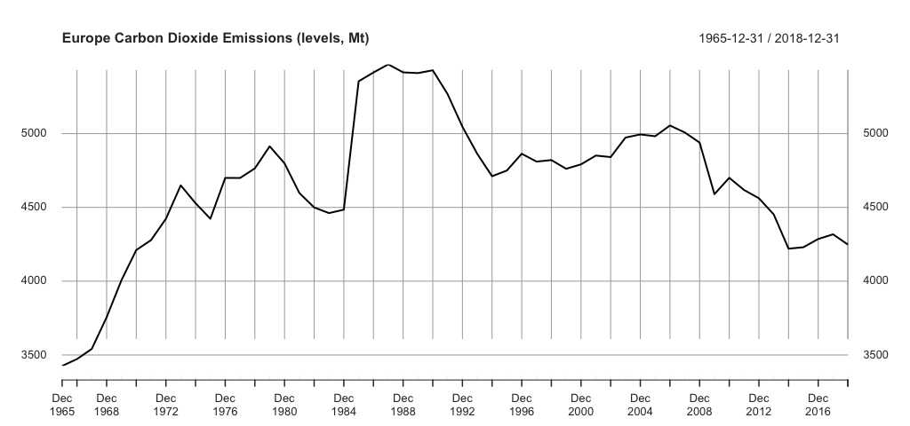
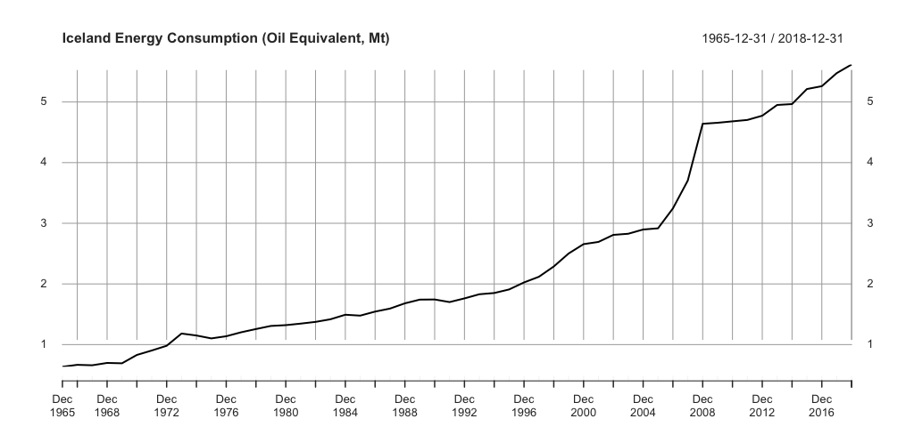
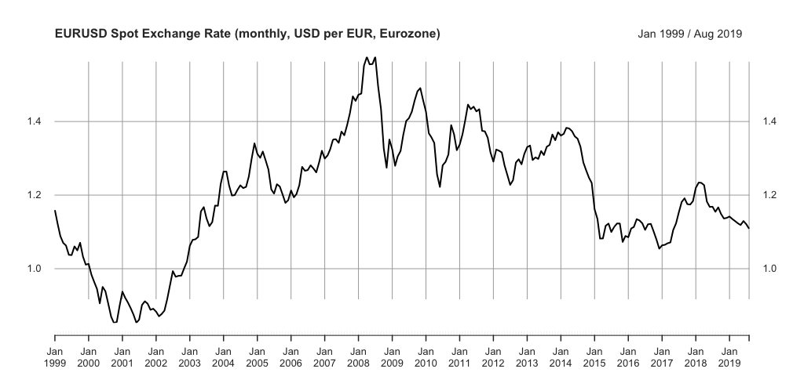
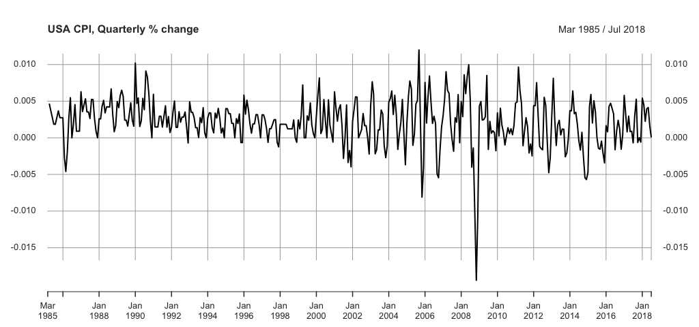
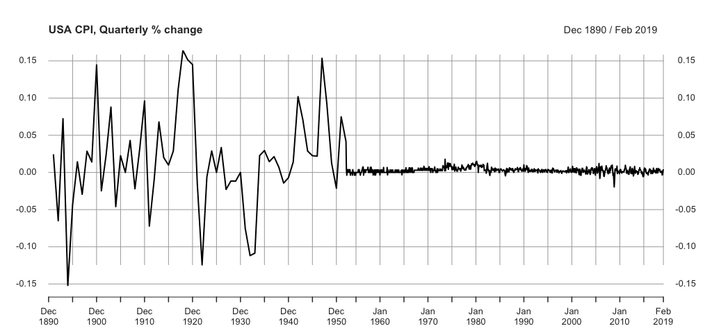
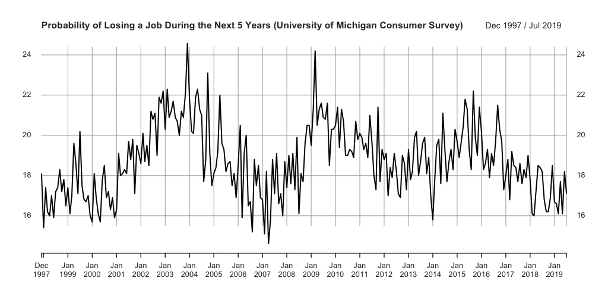
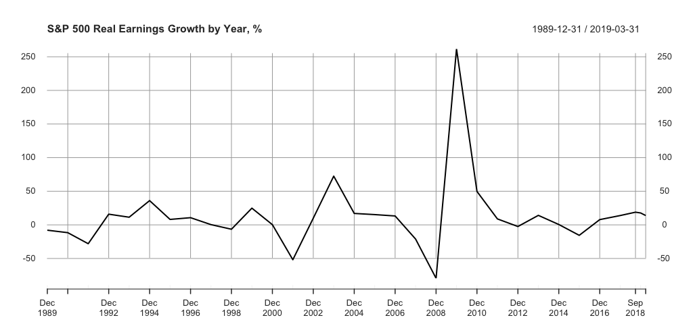

class: animated, fadeIn

##Outline for today

1. Quiz 1 results analysis

--

2. Stationarity: brief recall

3. Important real-life examples

--

4. Wrap-up

---
class: section, animated, flipInY

#Quiz 1 Results Analysis

### the results of the quiz are available on the **Padlet**

---
class: section, animated, fadeIn

#Stationarity

### several questions

---
class: center, animated, fadeIn

#Questions from the lecture  

.bb[?] Does weak stationarity imply strict stationarity?  *Construct a counterexample.*   

--

.bb[?] What are some common types of non-stationarity in economic data?  *Provide real-life examples of each.*

---
class: animated, fadeIn

#Problem 1

### For each of the following examples give and explain answers to the following  

.bb[?] Is it likely that the TS is stationary or not?  

.bb[?] If not, what types of non-stationarity are present?  

.bb[?] What kinds of testing do we need to conclude that?  

.bb[?] Is it likely that the propoerty persists if we consider another source of data or time period?

---
class: center, animated, fadeIn

###.gb[Example 1]

---
class: center, animated, fadeIn

###.gb[Example 2]

---
class: center, animated, fadeIn

###.gb[Example 3]

---
class: center, animated, fadeIn

###.gb[Example 4]

---
class: center, animated, fadeIn

###.gb[Example 5]

---
class: center, animated, fadeIn

###.gb[Example 6]

---
class: center, animated, fadeIn

###.gb[Example 7]

---
class: center, animated, fadeIn

###.gb[Example 8]

---
class: center, middle, animated, zoomIn

### As an exit ticket from the class, please,
## ask a question or leave a comment about this class

[wooclap.com/TSEXIT](https://www.wooclap.com/TSEXIT)

## See you next week!
