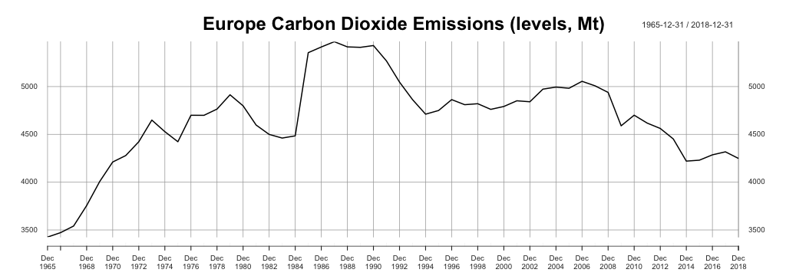
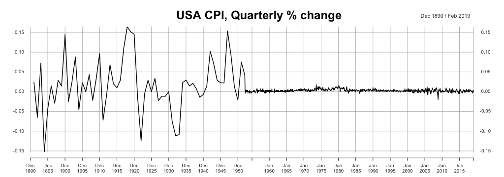
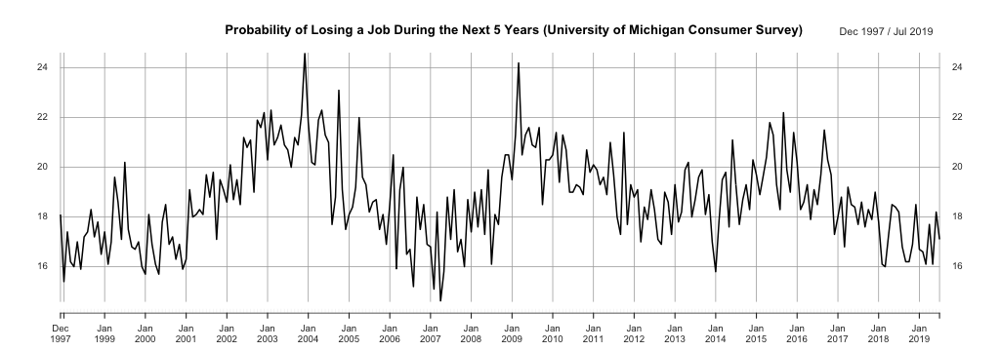

class: section, animated, fadeIn

###all kinds of

#Formal Tests

---
class: animated, fadeIn

##**Problem 1.** Conventional testing: recap

Consider a one-sample .RUred[one]-sided *z*-test, with data $\{x_i\}_{i=1}^N\sim\text{i.i.d.}$, $H_o=\{\mathbb{E}X=\mu\}$, and $H_a=\{\mathbb{E}X\color{red}<\mu\}$.

.bb[?] Construct the test statistics. .rmk[Is something missing?]

.bb[?] What's its distribution under the true null?

--

.bb[?] Suggest some appropriate critical size values $(\alpha)$.

--

.bb[?] What are the corresponding critical values (of the statistics)?</br> How are they different from the ones of the two-sided test?

--

.bb[?] Describe the test in terms of critical values and P-values.

---
class: center, animated, fadeIn

##**Problem 2.** Interpreting ADF & KPSS results (1)



--

```{r table21, echo=FALSE, message=FALSE, warnings=FALSE, results='asis'}
tabl <- " 
| Test  |  P-value   |
|:------|:----------:|
| ADF   |   0.4423   |
| KPSS  |   0.0827   |
"
cat(tabl)
```

.bb[?] Interpret the results & make a conclusion

---
class: center, animated, fadeIn

##**Problem 2.** Interpreting ADF & KPSS results (2)

 

--

```{r table22, echo=FALSE, message=FALSE, warnings=FALSE, results='asis'}
tabl <- " 
| Test  | P-value   |
|:------|:---------:|
| ADF   | < 0.01    |
| KPSS  |   0.0102  |
"
cat(tabl)
```

.bb[?] Interpret the results & make a conclusion

---
class: center, animated, fadeIn

##**Problem 2.** Interpreting ADF & KPSS results (3)

 

--

```{r table23, echo=FALSE, message=FALSE, warnings=FALSE, results='asis'}
tabl <- " 
| Test  | P-value   |
|:------|:---------:|
| ADF   | < 0.01    |
| KPSS  | 0.044    |
"
cat(tabl)
```

.bb[?] Interpret the results & make a conclusion

---
class: center, animated, fadeIn

##**Problem 2.** Interpreting ADF & KPSS results (4)

 

--

```{r table24, echo=FALSE, message=FALSE, warnings=FALSE, results='asis'}
tabl <- " 
| Test  | P-value   |
|:------|:---------:|
| ADF   | 0.3994    |
| KPSS  | > 0.1    |
"
cat(tabl)
```

.bb[?] Interpret the results & make a conclusion

---
class: section, animated, fadeIn

###Differences & other

#Stationary Transformations

---
class: animated, fadeIn

#Differences: quick recall

.bb[?] Define the first difference of some TS $\{X_t\}_{t=-\infty}^{+\infty}$

--

.bb[?] What do we mean by "*differences preserve units*"?

--

.bb[?] Give an example when differences are not meaningful.
.right[.rmk[recall that "*preserve units*" property again]]

--

.bb[?] Say, some TS differences are perfectly stationary. Then what's the initial TS like? .rmk[Assume the diffs are positive on average.]

--

.bb[?] When the diffs might not be enough to "kill" non-stationarity?
.right[.rmk[Give a general answer and a few real-life examples.]]

---
class: center, middle, animated, zoomIn

##Suggest a good way to
# transform a typical GDP to get a stationary TS

[wooclap.com/TSEXIT](https://www.wooclap.com/TSEXIT)


### Post your answer and ask a question about this class